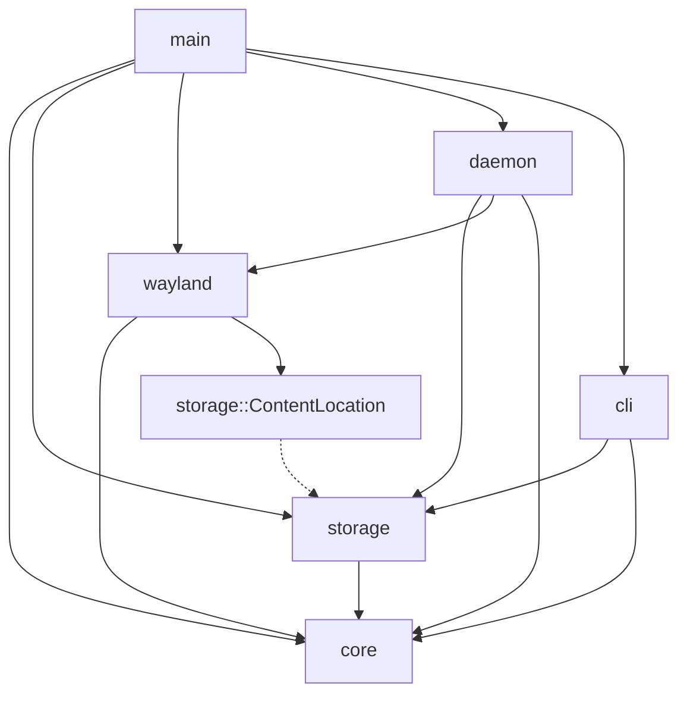

# y4p Internals — Overview

This is the entry point for `y4p`'s internal documentation. The [README](../README.md) tells you *what* the tool does and how to run it; everything under `docs/` tells you *why* it's built the way it is. Each file below is a self-contained theme — read the one your question actually falls under, not all four in order.

---

## 1. System Layer Architecture

`y4p` is one binary with two faces. Invoked as `y4p daemon`, it becomes a long-lived background process that owns the Wayland connection and the SQLite write path. Invoked as anything else (`list`, `copy-to`, `pin`, ...), it's a short-lived CLI process that either reads the database directly or sends a one-shot IPC command to the daemon and exits.

```
                         ┌────────────────────────────────────────┐
                         │              y4p daemon                │
                         │                                        │
   Wayland compositor ───┼──▶ wayland::handlers  ──▶  daemon::worker (mpsc, single writer)
   (ext-data-control-v1) │        (Ingress)                │
                         │                                 ▼
   $XDG_RUNTIME_DIR ─────┼──▶ daemon::ipc          storage::ClipboardDb ──▶ SQLite (WAL) + ~/.cache/y4p/
   /y4p.sock (IPC)       │   (Exit/Restore/Status)         ▲
                         │        │ (Egress: handle_restore_request)
                         │        └──▶ wayland::handlers::data_control::source
                         └────────────────────────────────────────┘
                                          ▲
                                          │ IPC (one-shot, e.g. `copy-to`)
                         ┌────────────────┴───────────────────────┐
                         │        y4p <command>  (CLI process)    │
                         │   cli::* ──▶ storage::ClipboardDb       │
                         │   (reads DB directly for list/search/   │
                         │    show; talks IPC only for daemon-     │
                         │    owned actions like copy-to/pause)    │
                         └──────────────────────────────────────┘
```

Four layers, each with one job:

- **`cli/`** — argument parsing, validation, and human-readable output. Never touches Wayland. Talks to `storage` directly for anything that's just a database read, and to the daemon over IPC only for actions the daemon must perform itself (restoring to the live clipboard, pausing ingestion).
- **`daemon/`** — process lifecycle, the IPC socket, and `DbWorker`, the single thread allowed to hold a write connection to SQLite (see [03](03_concurrency_and_memory.md)).
- **`wayland/`** — everything that speaks `ext-data-control-v1` to the compositor: ingesting new clipboard offers, serving history back out, and the low-level pipe/buffer plumbing in between (see [01](01_wayland_streaming_io.md)).
- **`storage/`** — a facade (`ClipboardDb`) over two things that must never touch each other's concerns: `db.rs` (pure SQL, no filesystem I/O) and `cache.rs` (the on-disk binary cache, no SQLite). Schema migrations live in `schema.rs` (see [02](02_hybrid_storage_and_pin.md)).

`core/` sits underneath all four as shared, dependency-free plumbing (XDG path resolution, the history-limit env var, the exit flag) — it depends on nothing else in the project, which is what keeps it usable from any layer without creating a cycle.

## 2. Module Dependency Diagram



The direction that matters is `wayland --> storage_types`: the Wayland egress path (`data_control::source`) needs to know whether a record's payload lives inline in SQLite or in the file cache, so it depends on `storage::ContentLocation` — but only that one type, not the rest of the storage module's internals. Nothing under `storage/` or `core/` ever imports from `wayland/`, `daemon/`, or `cli/`; dependencies only flow inward toward `core`. That's a deliberate constraint, not an accident: it's what lets `storage` be exercised (and reasoned about) without ever standing up a Wayland connection.

## 3. What to Read Next

- **[01 — Wayland Protocol & Streaming I/O](01_wayland_streaming_io.md)**: why the daemon multiplexes Wayland and IPC on one thread via `libc::poll`, why ingestion hashes and buffers in a single pass over 4KB-aligned memory, and how `provider_locks` stops the daemon from re-ingesting its own restores.
- **[02 — Hybrid Storage & Pin Protection](02_hybrid_storage_and_pin.md)**: why text/metadata and large binaries live in two different storage engines, how `PRAGMA user_version` lets the schema evolve without ever touching existing rows, and how Pin protection carves pinned records out of the rotation limit without shrinking anyone else's quota.
- **[03 — Concurrency & Memory Reclamation](03_concurrency_and_memory.md)**: why every database write funnels through one `mpsc`-fed worker thread, and why the daemon calls `malloc_trim(0)` after handling large payloads instead of trusting the allocator.
- **[04 — Stable IDs & the Strict CLI](04_strict_cli_and_stable_id.md)**: why display order (MRU) and identity (stable ID) are deliberately two different numbers, and why the CLI parser treats an unrecognized flag as an error instead of a best-effort guess.
